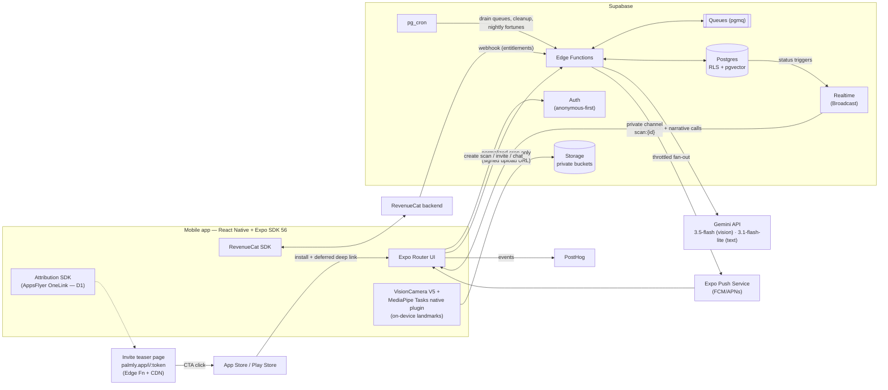
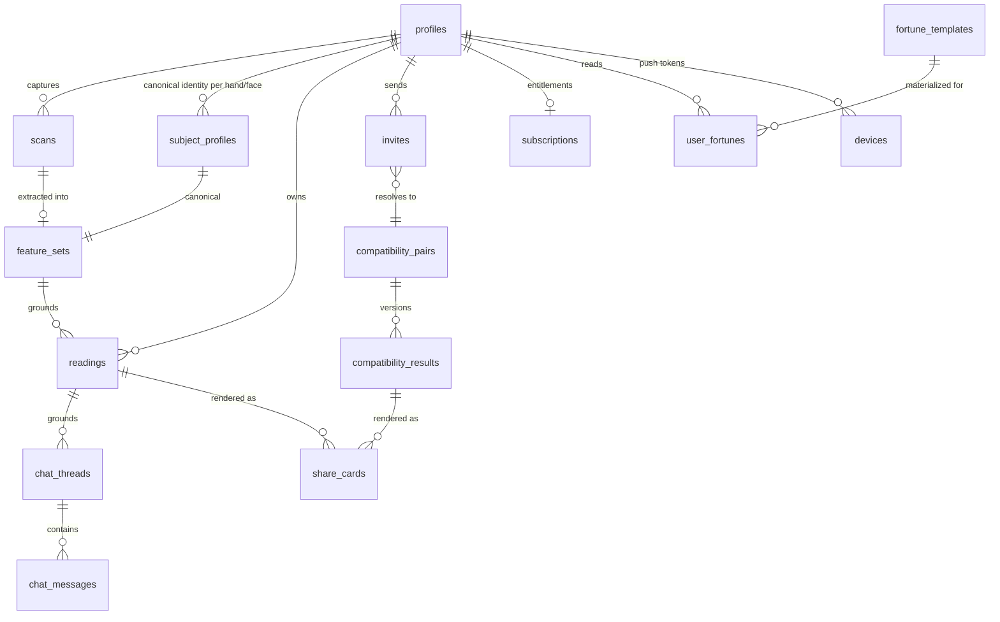

# Palmly — Backend & Systems Specification

**Status:** Planning — v1.0 (July 2026)
**Companion doc:** `Planning/UIUX-specs.md`
**Ground truth:** `Planning/mvp_spec.md` — this document implements its decisions and does not relitigate them except where flagged below.

Every architectural choice in this document is evaluated against the two product priorities from the MVP spec:

1. **P1 — Trustworthy reading experience:** capture → reading must be fast, smooth, and *consistent across repeat scans*.
2. **P2 — The virality loop:** nothing may add friction to share → invite → install → land-in-context, and the backend must survive the traffic spikes the loop is designed to create.

---

## ⚠️ 0. Decisions needed from you / flagged assumptions

These are surfaced up front per your instruction. Everything below proceeds on the stated assumption; correct any of them and the affected section is isolated enough to swap.

| # | Topic | Finding | Assumption made in this doc |
|---|---|---|---|
| **D1** | **Attribution provider** — ✅ **DECIDED (2026-07-11): AppsFlyer OneLink, Zero tier** | Branch removed its self-serve free tier in **July 2025**; entry pricing is now reportedly **$199–499/mo** (no public numbers — sales quote required), and Deepviews + dynamic `$og_image_url` previews are premium-gated ([source](https://chottulink.com/blog/branch-io-vs-chottulink-which-deep-linking-platform-wins-in-2025-flexibility-vs-enterprise-lock-in-2/), [Branch pricing](https://www.branch.io/pricing/), [community reports](https://community.flutterflow.io/discussions/post/branch-io-pricing-change-to-499-dollars-per-month-VXz7xJMLnZzYKss)). Firebase Dynamic Links is confirmed dead (sunset Aug 25, 2025). | Per your decision, the build targets **AppsFlyer OneLink (free Zero tier — 12K attributed conversions/yr, then $0.07 each)**. Architecture in §8 stays **provider-pluggable** behind a self-hosted invite/teaser page + our own clipboard/referrer token flow, so this remains a one-module swap if AppsFlyer disappoints. Two verifications owed before integration week: (a) confirm with AppsFlyer whether owned-media invite installs count against the Zero conversion cap long-term; (b) confirm their iOS deferred-matching behavior alongside our own clipboard mechanism. |
| **D2** | **Raw image retention** | Spec §9 requires minimal retention; competitors market "we don't store your image" as a trust feature. | **Full-frame camera photos never leave the device** (client crops/normalizes first). The normalized palm/face crop is deleted from Storage **24h after successful feature extraction** (cron), or immediately on user request. Consequence: re-running a *better future extractor* on old scans is impossible unless the user opts into "keep my scan" (settings toggle, default OFF). |
| **D3** | **AI model selection** — ✅ **DECIDED (2026-07-11): all-Gemini hybrid** | Full pricing/capability comparison in §6.4 (verified against official pricing pages 2026-07-11). DeepSeek V4 Flash was evaluated and rejected for this pipeline: **text-only** (no image input — cannot run extraction), instruction-based JSON mode only, and PRC-hosted (bad optics for biometric-adjacent data even without images). Gemini 3.5 Flash turned out to be Sonnet-class pricing, so the savings come from tier-pairing. | **`gemini-3.5-flash`** ($1.50/$9.00 per MTok) for the trust-critical extraction pass; **`gemini-3.1-flash-lite`** ($0.25/$1.50) for all text passes (narrative, compatibility, chat, fortunes). ≈ $0.03/new user vs $0.07–0.11 all-Claude. One vendor/SDK, schema-enforced outputs + context caching + 50% Batch API throughout. **Gate:** a 30–50-labeled-palm extraction bake-off vs `claude-sonnet-5` before launch lock — the pipeline is model-agnostic, so a revert is a config change. **Production keys must be Gemini paid tier** (free tier explicitly uses content to improve Google products). |
| **D4** | **Anonymous users & Supabase MAU billing** | Supabase MAU is billed as "distinct users who log in or refresh their token"; there is no documented carve-out for anonymous users, so they almost certainly count ($0.00325/MAU past 100K on Pro) ([docs](https://supabase.com/docs/guides/platform/manage-your-usage/monthly-active-users)). | Cost model in §12 includes anonymous users as billable MAU. Verify with Supabase support before launch. |
| **D5** | **Hand landmark detection library** | No maintained off-the-shelf React Native library exists in 2026 — `react-native-mediapipe` is effectively abandoned (last release Dec 2024, pre–New-Architecture) ([repo](https://github.com/cdiddy77/react-native-mediapipe)). | We build a **small custom native plugin (~300 lines Kotlin + ~300 lines Swift) wrapping Google's first-party MediaPipe Tasks SDKs** (`tasks-vision`), exposed to VisionCamera V5. This is an engineering line-item, not a stack change — details in §2.2. Budget a 1-week spike before sprint planning. |
| **D6** | **Web teaser page hosting** | Needs custom-domain SSR HTML with per-invite OG tags. | Served by a Supabase Edge Function on a custom domain (`palmly.app/i/{token}`), CDN-cached. A Cloudflare Pages/Workers micro-site is an equivalent alternative if we outgrow the 2s CPU limit. |

---

## 1. High-level architecture

**Stack (confirmed against July 2026 ecosystem state — see §2 for validation):** React Native + Expo (SDK 56, New Architecture), VisionCamera V5, custom MediaPipe Tasks plugin, Supabase (Postgres + Auth + Storage + Edge Functions + Queues + Realtime + pgvector), Gemini API (`gemini-3.5-flash` vision extraction + `gemini-3.1-flash-lite` text — decided, D3), RevenueCat, AppsFlyer OneLink (decided — D1), Expo Push, PostHog.



**Core request flows:**

1. **Reading pipeline (P1):** client captures → on-device landmark guidance → client crops/warps to canonical frame → uploads crop via signed URL → Edge Function enqueues job → worker calls Gemini (extraction pass on 3.5 Flash, then narrative pass on Flash-Lite) → status updates broadcast over Realtime → client renders reveal. Target p50 ≤ 20s end-to-end, p95 ≤ 60s.
2. **Virality loop (P2):** user taps share → server-rendered share card (already generated during reading pipeline) + invite link → friend hits teaser page (OG-rich, in-app-webview safe) → store → install → deferred deep link → lands in compatibility context → their own reading pipeline runs → compatibility worker joins the pair.
3. **Retention loop:** nightly cron pre-generates daily fortunes per (date × pillar-bucket × locale) via the Batch API → morning push at user-local time → app opens to fortune home.

**Why queue-based rather than request/response for AI work:** Supabase's official recommendation for jobs of this shape is pgmq + cron-drained Edge Function workers ([Supabase: processing large jobs](https://supabase.com/blog/processing-large-jobs-with-edge-functions)). For Palmly the queue is doing double duty: it survives viral install spikes (jobs buffer instead of 429ing users), and queue drain rate is our **natural backpressure valve against Gemini API rate limits** (§11.1). Edge Function limits (2s CPU / 400s wall-clock on paid — AI calls are I/O wait, which doesn't consume CPU budget) comfortably fit one reading job per invocation ([limits](https://supabase.com/docs/guides/functions/limits)).

---

## 2. Stack validation & amendments

The MVP spec's stack survives 2026 scrutiny with the following notes (researched July 2026):

### 2.1 Expo / React Native baseline
- **Expo SDK 56** (RN 0.85, New Architecture mandatory since SDK 55 — legacy arch is removed, so every dependency must be New-Arch compatible) ([changelog](https://expo.dev/changelog/sdk-55)).
- The app is a **dev-client / EAS Build app from day one**. Nothing in this stack (VisionCamera, MediaPipe plugin, RevenueCat, Branch) runs in Expo Go.
- Worklets: use Software Mansion's `react-native-worklets` (the current standard; `react-native-worklets-core` is legacy). Reanimated 4 for UI animation shares the same runtime.

### 2.2 Guided capture (per D5 — the one custom-native component)
- **VisionCamera V5** (Nitro Modules rewrite; frame processors renamed to "Frame Output" — `useFrameOutput`). V5 is ~3 months old and V4 is EOL; pin exact versions and budget for its youth ([docs](https://visioncamera.margelo.com/docs/guides)). Frames must be explicitly `dispose()`d in V5.
- **Hand landmarks:** custom native frame-processor plugin wrapping **Google MediaPipe Tasks** (`com.google.mediapipe:tasks-vision` / `MediaPipeTasksVision` pod), HandLandmarker in LIVE_STREAM mode with GPU delegate — 30fps on mid-range devices. JS receives only 21 normalized keypoints/frame. Fallbacks if the spike fails: `react-native-fast-tflite` v3 (Nitro, actively maintained) with raw `.tflite` models (requires DIY palm-detector→landmark two-stage logic), or Apple Vision `VNDetectHumanHandPoseRequest` (iOS-only).
- **Face landmarks:** `react-native-vision-camera-face-detector` (ML Kit-based; v2.0.6 released July 2026, already VC-V5-compatible) provides 133-point contours + head Euler angles — sufficient for guided capture ([repo](https://github.com/luicfrr/react-native-vision-camera-face-detector)). If the 面相 analysis later needs the full 468/478-point mesh cross-platform, add FaceLandmarker to the same custom MediaPipe plugin (one plugin architecture covers both).
- **Live overlay rendering:** frame processor writes landmarks into Reanimated shared values → absolutely-positioned Skia `<Canvas>` over the camera preview. This is the battle-tested pattern; do *not* build on Skia Frame Processors (`<SkiaCamera>`) — still preview-grade.
- **P1 note:** this on-device layer is what makes capture feel effortless *and* it is the first stage of the consistency system (§6.6) — the same landmark geometry that drives "flatten your hand / move closer" also drives the canonical crop, so repeat scans produce near-identical input pixels.

### 2.3 Everything else
- **RevenueCat:** `react-native-purchases` + `react-native-purchases-ui` — first-class Expo support, Paywalls v2 GA in React Native (remote-configured paywalls, no app update needed). The most solid item in the stack ([docs](https://www.revenuecat.com/docs/getting-started/installation/expo)).
- **Attribution (D1 — decided):** AppsFlyer `react-native-appsflyer` + its Expo config plugin. Same operational rule that applied to Branch's plugin: pin exact plugin+SDK version pairs and retest deferred deep links on every Expo SDK upgrade — attribution SDKs are historically the most upgrade-fragile dependency class in Expo projects. Note our loop does not depend on the vendor for correctness (self-hosted teaser + clipboard/referrer tokens, §8.2); AppsFlyer adds attribution analytics and matching redundancy.
- **Push:** `expo-notifications` + Expo Push Service. The client API is provider-agnostic (`getDevicePushTokenAsync` exposes the raw FCM/APNs token), so a later migration to direct FCM/APNs or OneSignal requires no app change. Constraint to design around: **~600 notifications/sec/project** — fan-out must be queue-throttled (§11).
- **Analytics: PostHog** (chosen from the spec's Mixpanel/Amplitude/PostHog shortlist — generous free tier, self-serve funnels + retention cohorts, RN SDK, EU/US hosting choice). Required day-one events in §12.6.

---

## 3. Data model

Conventions: all tables in `public`, RLS enabled on every table, `service_role` used only inside Edge Functions. Timestamps are `timestamptz`. IDs are `uuid default gen_random_uuid()`.

### 3.1 Entity-relationship overview



### 3.2 Tables

```sql
-- ============ Identity ============
-- auth.users is Supabase-managed. Anonymous-first: signInAnonymously() creates a
-- real auth.users row; later linkIdentity()/updateUser() upgrades it IN PLACE, so
-- the uuid — and every row below — carries over with zero migration.
create table profiles (
  id              uuid primary key references auth.users on delete cascade,
  display_name    text,
  avatar_url      text,
  locale          text not null default 'en',
  timezone        text not null default 'Asia/Singapore',
  birth_date      date,          -- optional; BaZi-lite day pillar for fortunes
  dominant_hand   text check (dominant_hand in ('left','right')),
  element_profile jsonb,         -- derived Five-Element summary (fortune bucketing)
  is_anonymous    boolean not null default true,  -- mirrored from JWT at write time
  created_at      timestamptz not null default now(),
  updated_at      timestamptz not null default now()
);

-- ============ Scans & features (the consistency core) ============
create table scans (
  id             uuid primary key default gen_random_uuid(),
  user_id        uuid not null references profiles on delete cascade,
  kind           text not null check (kind in ('palm','face')),
  side           text check (side in ('left','right')),  -- palm only
  status         text not null default 'uploaded' check (status in
                   ('uploaded','queued','extracting','matched','narrating','complete','failed')),
  storage_path   text,             -- normalized crop in private bucket; nulled on deletion
  image_deleted_at timestamptz,    -- D2 retention audit
  capture_meta   jsonb not null default '{}',  -- device, landmark quality, lighting score,
                                               -- plugin+model versions (debug + consistency audit)
  failure_reason text,
  created_at     timestamptz not null default now()
);
create index on scans (user_id, created_at desc);

-- Deterministic structured features extracted from a scan (pass 1 output).
create table feature_sets (
  id                     uuid primary key default gen_random_uuid(),
  scan_id                uuid not null references scans on delete cascade,
  user_id                uuid not null references profiles on delete cascade,
  kind                   text not null check (kind in ('palm','face')),
  side                   text,
  features               jsonb not null,     -- enum-bucketed, schema-validated (see §6.3)
  feature_schema_version int  not null,
  extractor_version      text not null,      -- cv-pipeline + model + prompt version tuple
  geometry               jsonb not null,     -- normalized landmark ratios for identity matching
  feature_hash           text not null,      -- sha256 of canonicalized features JSON
  extraction_confidence  numeric,
  created_at             timestamptz not null default now()
);
create index on feature_sets (user_id, kind, side);

-- One canonical identity per (user, hand-or-face). THIS is what makes repeat
-- scans consistent: new scans are matched against it and REUSE its features.
create table subject_profiles (
  id                       uuid primary key default gen_random_uuid(),
  user_id                  uuid not null references profiles on delete cascade,
  kind                     text not null check (kind in ('palm_left','palm_right','face')),
  canonical_feature_set_id uuid not null references feature_sets,
  scan_count               int not null default 1,
  last_matched_at          timestamptz,
  unique (user_id, kind)
);

-- ============ Readings ============
create table readings (
  id              uuid primary key default gen_random_uuid(),
  user_id         uuid not null references profiles on delete cascade,
  feature_set_id  uuid not null references feature_sets,
  kind            text not null check (kind in ('palm','face','combined')),
  narrative       jsonb not null,   -- structured sections: {headline, summary, heart_line,
                                    --  head_line, life_line, fate_line, hand_shape, mounts[],
                                    --  three_courts, five_eyes, ...} each {title, body, tags[]}
  depth_level     int not null default 1,     -- progressive unlock (1=free tier)
  model_id        text not null,
  prompt_version  text not null,
  kb_version      text not null,
  tokens_in       int, tokens_out int,        -- cost telemetry
  created_at      timestamptz not null default now()
);
create index on readings (user_id, created_at desc);

-- ============ Compatibility (canonical pair ordering) ============
create table compatibility_pairs (
  id         uuid primary key default gen_random_uuid(),
  user_a     uuid not null references profiles on delete cascade,
  user_b     uuid not null references profiles on delete cascade,
  created_at timestamptz not null default now(),
  check (user_a < user_b),          -- canonical ordering: race-proof uniqueness
  unique (user_a, user_b)
);
create index on compatibility_pairs (user_a);
create index on compatibility_pairs (user_b);   -- index both sides for "my pairs" queries

create table compatibility_results (
  id                uuid primary key default gen_random_uuid(),
  pair_id           uuid not null references compatibility_pairs on delete cascade,
  status            text not null default 'pending' check (status in
                      ('pending','awaiting_b','computing','complete','failed')),
  score             int check (score between 0 and 100),
  sub_scores        jsonb,          -- {emotion, mind, life_energy, destiny, elements} 0–100 each
  narrative         jsonb,          -- structured sections, both-perspectives
  algorithm_version text not null,  -- deterministic scorer version (§7)
  model_id          text, prompt_version text, kb_version text,
  feature_set_a     uuid references feature_sets,   -- pinned inputs → reproducible
  feature_set_b     uuid references feature_sets,
  created_at        timestamptz not null default now()
);

-- ============ Invites (the viral loop's spine) ============
create table invites (
  id           uuid primary key default gen_random_uuid(),
  inviter_id   uuid not null references profiles on delete cascade,
  invitee_id   uuid references profiles,           -- filled on acceptance
  token_hash   text not null unique,               -- sha256; raw token only in the link
  kind         text not null default 'compatibility' check (kind in ('compatibility','generic')),
  context      jsonb not null default '{}',        -- {reading_id, card_variant, inviter_name}
  status       text not null default 'created' check (status in
                 ('created','clicked','installed','accepted','expired','revoked')),
  channel      text,                               -- whatsapp | line | zalo | wechat | copy | qr...
  clicked_at   timestamptz, installed_at timestamptz, accepted_at timestamptz,
  expires_at   timestamptz not null default now() + interval '30 days',
  created_at   timestamptz not null default now()
);
create index on invites (inviter_id, created_at desc);

-- ============ Subscriptions (RevenueCat mirror) ============
create table subscriptions (
  user_id          uuid primary key references profiles on delete cascade,
  rc_app_user_id   text not null,
  entitlements     jsonb not null default '{}',  -- {"premium": {"expires_at":..., "product_id":..., "store":...}}
  status           text,                          -- active | in_grace | billing_issue | expired
  latest_event_at  timestamptz,
  updated_at       timestamptz not null default now()
);
create table subscription_events (   -- raw webhook audit log (idempotency + debugging)
  id          uuid primary key default gen_random_uuid(),
  rc_event_id text unique,           -- idempotency key
  user_id     uuid,
  type        text,
  payload     jsonb not null,
  created_at  timestamptz not null default now()
);

-- ============ Daily fortunes (retention layer) ============
-- KEY DESIGN: fortunes are generated per (date × pillar_bucket × locale), NOT per
-- user. 60 day-pillar interaction buckets × locales ≈ 120–300 generations/day
-- (batched, 50% off) instead of one model call per DAU. Personalization is a
-- deterministic client/server merge of the user's element_profile onto the bucket.
create table fortune_templates (
  fortune_date   date not null,
  pillar_bucket  text not null,     -- user's element_profile → bucket, computed deterministically
  locale         text not null,
  content        jsonb not null,    -- {overall, career, love, wealth, do[], dont[],
                                    --  lucky_direction, lucky_color, lucky_hours}
  model_id text, prompt_version text,
  primary key (fortune_date, pillar_bucket, locale)
);
create table user_fortunes (         -- read receipts / streaks / notification targeting
  user_id      uuid not null references profiles on delete cascade,
  fortune_date date not null,
  pillar_bucket text not null,
  opened_at    timestamptz,
  primary key (user_id, fortune_date)
);

-- ============ Chat (premium) ============
create table chat_threads (
  id         uuid primary key default gen_random_uuid(),
  user_id    uuid not null references profiles on delete cascade,
  reading_id uuid references readings,
  created_at timestamptz not null default now()
);
create table chat_messages (
  id         uuid primary key default gen_random_uuid(),
  thread_id  uuid not null references chat_threads on delete cascade,
  role       text not null check (role in ('user','assistant')),
  content    text not null,
  tokens_in  int, tokens_out int,
  created_at timestamptz not null default now()
);
create index on chat_messages (thread_id, created_at);

-- ============ Share cards ============
create table share_cards (
  id            uuid primary key default gen_random_uuid(),
  user_id       uuid not null references profiles on delete cascade,
  source_type   text not null check (source_type in ('reading','compatibility','fortune')),
  source_id     uuid not null,
  variant       text not null,      -- feed_4x5 | story_9x16
  locale        text not null,
  storage_path  text not null,      -- public-read bucket behind CDN, immutable cache headers
  created_at    timestamptz not null default now()
);

-- ============ Devices / push ============
create table devices (
  id              uuid primary key default gen_random_uuid(),
  user_id         uuid not null references profiles on delete cascade,
  expo_push_token text unique,
  platform        text check (platform in ('ios','android')),
  locale          text, timezone text,
  notif_prefs     jsonb not null default '{"daily_fortune": true, "social": true}',
  last_seen_at    timestamptz not null default now()
);

-- ============ RAG knowledge base (§6.5) ============
create table kb_chunks (
  id          uuid primary key default gen_random_uuid(),
  kb_version  text not null,
  tradition   text not null check (tradition in ('palmistry','physiognomy','almanac')),
  feature_key text not null,        -- e.g. 'heart_line.deep_long' — deterministic lookup key
  content     text not null,
  embedding   vector(1024),         -- pgvector; embeddings for fuzzy retrieval in chat
  created_at  timestamptz not null default now()
);
create index on kb_chunks (kb_version, tradition, feature_key);

-- ============ Deletion / compliance audit ============
create table deletion_log (
  id uuid primary key default gen_random_uuid(),
  user_id uuid, scope text,          -- 'images' | 'account' | 'scan:{id}'
  requested_at timestamptz not null default now(),
  completed_at timestamptz
);
```

### 3.3 Row-Level Security

Patterns follow Supabase's official RLS performance guide (each rule has measured 10–1000× impact — [source](https://supabase.com/docs/guides/troubleshooting/rls-performance-and-best-practices-Z5Jjwv)):

- **Always** `to authenticated`, **always** wrap `auth.uid()` as `(select auth.uid())` (initPlan caching: 171ms → 9ms on 100K rows), **always** index policy columns, and **duplicate the filter client-side** (`.eq('user_id', uid)`) — RLS is a check, not an optimizer hint.
- Owner-only tables (`scans`, `feature_sets`, `readings`, `chat_*`, `devices`, `user_fortunes`, `share_cards`): `using ((select auth.uid()) = user_id)`.
- **Pair visibility** (compatibility): `using ((select auth.uid()) in (user_a, user_b))` on `compatibility_pairs`; results check pair membership through a `security definer` helper function (avoids RLS-on-RLS recursion — the documented failure mode for join tables).
- `invites`: inviter sees own rows; invitee sees rows where `invitee_id = (select auth.uid())`. **Token verification never happens through RLS** — the claim flow goes through an Edge Function using `service_role`, comparing `sha256(raw_token)` against `token_hash` (raw tokens are never stored).
- `subscriptions`: `select` only, owner-only. All writes come from the RevenueCat webhook function (service role).
- `fortune_templates`, `kb_chunks`: readable by `authenticated` (content is not user data); fortune *depth* gating is enforced in the API layer against entitlements, not RLS.
- Anonymous users are full `authenticated` users with an `is_anonymous` JWT claim. Actions reserved for permanent accounts (e.g., appearing by name on a friend's compatibility card) use a restrictive policy on `(auth.jwt()->>'is_anonymous')::boolean is false`.
- Never reference `raw_user_meta_data` in policies (user-editable); only `raw_app_meta_data`.
- Storage: private buckets, path convention `scans/{user_id}/{scan_id}.jpg`, RLS on `storage.objects` keyed on `storage.foldername(name)[2] = (select auth.uid())::text`; uploads via `createSignedUploadUrl()` so the client never holds broad storage permissions.

---

## 4. API / service layer

All server logic lives in Supabase Edge Functions (Deno). Three auth modes: `user` (JWT verified, RLS-scoped client), `secret` (internal, service-role), `none` (public endpoints with their own verification — webhooks, teaser page). Note: Supabase's Functions SDK now exposes this as declarative `auth` modes with `ctx.supabase` / `ctx.supabaseAdmin`; the older forwarded-Authorization-header pattern is documented as legacy — pin against the CLI version at build time ([docs](https://supabase.com/docs/guides/functions/auth)).

| Function | Auth | Purpose |
|---|---|---|
| `scan-create` | user | Validates quota (free tier: unlimited first palm+face per spec §4.6; rate-limit 10 scans/day/user), inserts `scans` row, returns signed upload URL + scan id. |
| `scan-ingest` | secret | Storage webhook on upload completion → enqueue `scan_jobs` (pgmq), set `status='queued'`. |
| `worker-scan` | secret (cron-invoked) | Drains `scan_jobs`: preprocess check → Gemini 3.5 Flash extraction pass → identity match against `subject_profiles` → store/reuse `feature_sets` → enqueue `narrative_jobs` (or short-circuit to stored reading on match — §6.6). One message per invocation; failures reappear after visibility timeout (retry), then dead-letter after 3 attempts. |
| `worker-narrative` | secret | Drains `narrative_jobs`: Gemini Flash-Lite narrative pass grounded on features + KB → insert `readings` → trigger share-card pre-render → status `complete` (Realtime broadcast fires via trigger). |
| `compat-request` | user | Creates/finds canonical pair, inserts `compatibility_results(status)`, enqueues `compat_jobs` when both members have canonical features. Entitlement check: first comparison free, further gated. |
| `worker-compat` | secret | Deterministic scorer + Gemini Flash-Lite narrative (§7). |
| `invite-create` | user | Generates 32-byte token, stores hash + context, returns `palmly.app/i/{token}` (wrapped in an AppsFlyer OneLink for attribution — D1). |
| `invite-claim` | user | Called on first app open with a deferred token: verifies hash, marks accepted, links `invitee_id`, creates pair, returns routing context `{inviter_name, pair_id}`. Idempotent. |
| `invite-page` | none | SSR HTML teaser at `palmly.app/i/{token}`: per-invite OG tags, inviter first name, CTA button (arms clipboard for iOS deferred matching), store redirects. CDN-cached per token. |
| `card-render` | secret | Renders share card PNG via `npm:@vercel/og` (satori) per Supabase's official OG-image pattern ([example](https://supabase.com/docs/guides/functions/examples/og-image)); writes to public bucket with immutable cache headers. Pre-rendered during the reading pipeline so share is instant (P2). |
| `revenuecat-webhook` | none + HMAC | Verifies RC signature, upserts `subscriptions`, appends `subscription_events` (idempotent on `rc_event_id`). |
| `chat-send` | user | Entitlement-gated; streams the Gemini Flash-Lite response (SSE) grounded on the thread's reading features + KB retrieval. |
| `fortune-generate` | secret (nightly cron) | Submits next-day fortune batch to the Gemini **Batch API** (50% discount); poller ingests results into `fortune_templates`. |
| `push-dispatch` | secret (cron) | Drains `push_jobs` in ≤500/s chunks (headroom under Expo's ~600/s), batches per Expo API, records receipts. |
| `account-delete` | user | Full erasure: rows (cascade), storage objects via Storage API (SQL deletes would orphan S3 objects), RevenueCat subscriber delete, provider data-deletion request; writes `deletion_log`. |
| `cleanup` | secret (cron hourly) | D2 image deletion (crops >24h past extraction), expired invites, stale anonymous users (>30 days, no linked identity — per Supabase guidance), orphaned storage objects. |

**Queues (pgmq):** `scan_jobs`, `narrative_jobs`, `compat_jobs`, `push_jobs`, `cleanup_jobs`. Not exposed through the Data API (server-only). Cron drains high-priority queues every 10–15s; one message per invocation.

**Client data access:** simple reads (my readings, my fortunes, pair list) go straight through supabase-js + RLS — no function hop. Mutations with business rules go through functions.

---

## 5. Auth & subscription entitlement flow

### 5.1 Anonymous-first auth (spec §4.3: no signup before first reading)

1. First launch → `signInAnonymously()` → real `auth.users` row, full `authenticated` role ([docs](https://supabase.com/docs/guides/auth/auth-anonymous)). All scans/readings attach to this UUID immediately.
2. Account-creation trigger points (save, compatibility, daily fortune — per spec) call `linkIdentity()` (Apple/Google OAuth) or `updateUser({phone})` + OTP. **The UUID is upgraded in place — zero data migration.** Requires "manual linking" enabled in the dashboard (beta).
3. Edge case (documented Supabase limitation): anonymous user tries to link an identity that already belongs to an existing account → no automatic merge. Flow: sign into the existing account, then re-parent the anonymous session's rows (`scans`, `readings`, `invites`) via a dedicated `account-merge` function. Rare but must exist before launch — the compatibility loop makes "installed on a second device" likely.
4. Abuse controls: Supabase's built-in 30 anonymous sign-ins/hour/IP + invisible CAPTCHA (Turnstile) on session creation. Cleanup cron deletes stale anonymous users (30 days, no readings) to bound MAU cost (D4).

### 5.2 RevenueCat entitlement flow

```
Client                         RevenueCat                    Supabase
  │ configure(apiKey,            │                              │
  │  appUserID = supabase uuid)  │                              │
  │────────────────────────────► │                              │
  │  purchase (anonymous OK)     │                              │
  │────────────────────────────► │──── webhook (signed) ───────►│ revenuecat-webhook
  │                              │                              │  upsert subscriptions
  │ getCustomerInfo() ──────────►│                              │  append subscription_events
  │  (client-side gate: instant) │                              │
  │ Edge Functions check subscriptions table (server-side gate: authoritative)
```

- **Set `appUserID` to the Supabase user UUID at configure time** — one identity across both systems, works for anonymous users, and survives account linking (UUID doesn't change). No RevenueCat alias juggling.
- **Two-layer gating:** client uses the RC SDK's `customerInfo.entitlements` for instant UI decisions; every server-side privileged operation (deep-dive generation, chat, extra compatibility) re-checks the `subscriptions` table. Client state is a hint; the table is truth.
- Webhook events are idempotent on `rc_event_id`; handle `INITIAL_PURCHASE`, `RENEWAL`, `CANCELLATION`, `BILLING_ISSUE`, `EXPIRATION`, `PRODUCT_CHANGE`, `TRANSFER`. Grace-period/billing-retry config matters disproportionately for Play (32.2% of Play cancellations are billing errors vs 15.2% App Store — [RevenueCat 2026](https://www.revenuecat.com/blog/growth/subscription-app-trends-benchmarks-2026/)); enable Play grace periods.
- Paywall UI itself is RevenueCat **Paywalls v2** (remote-configured — lets us run the paywall experiments the UIUX doc specifies without app releases).

---

## 6. The AI analysis pipeline (P1 core)

### 6.1 End-to-end sequence

```mermaid
sequenceDiagram
    participant C as Client (RN)
    participant S as Storage
    participant Q as pgmq
    participant W as worker-scan / worker-narrative
    participant A as Gemini API
    participant DB as Postgres
    participant RT as Realtime

    C->>C: on-device landmarks drive guidance;<br/>auto-capture when stable
    C->>C: crop + warp to canonical frame<br/>(deterministic, versioned)
    C->>S: upload crop (signed URL)
    S-->>Q: scan-ingest → enqueue scan_jobs
    Note over C,RT: client subscribes to private channel scan:{id}
    Q->>W: cron drains (≤15s latency)
    W->>A: PASS 1 — extraction (structured output, enum schema)
    A-->>W: features JSON (guaranteed schema-valid)
    W->>DB: identity-match vs subject_profiles
    alt same hand as before (match)
        W->>DB: reuse canonical feature_set + stored reading
        DB-->>RT: status: complete (fast path, ~seconds)
    else new subject / first scan
        W->>DB: store feature_set, update subject_profile
        W->>Q: enqueue narrative_jobs
        Q->>W: worker-narrative
        W->>A: PASS 2 — narrative (features + KB only, NO image)
        A-->>W: structured narrative JSON
        W->>DB: insert reading; pre-render share card
        DB-->>RT: status: complete
    end
    RT-->>C: broadcast → reveal screen
```

Status delivery uses **Realtime Broadcast from Database** (an `AFTER UPDATE` trigger on `scans.status` calls `realtime.broadcast_changes('scan:'||id, ...)`), on **private channels** authorized via RLS on `realtime.messages`. Broadcast, not Postgres Changes — Supabase's own benchmarks show Postgres Changes degrading ≥90% under RLS at scale, while Broadcast holds 800K msgs/s ([benchmarks](https://supabase.com/docs/guides/realtime/benchmarks), [broadcast-from-database](https://supabase.com/blog/realtime-broadcast-from-database)). Broadcast is ephemeral, so on subscribe/reconnect the client first fetches current `scans.status`, then listens. If the app is backgrounded when the reading completes, a push notification ("Your reading is ready") covers the gap.

### 6.2 Pass 1 — feature extraction (image → structured JSON)

- **Input:** the canonical crop (client-side: palm warped to fixed orientation via landmarks, 1536×1536, fixed JPEG q85; CLAHE contrast enhancement to raise faint creases, applied deterministically with pinned parameters). Gemini tiles image inputs (~258 tokens per 768px tile), so our crop costs ≈ 1.1K input tokens; verify exact counts against the `countTokens` endpoint at build time.
- **Call shape:** image part *before* the text instruction; frozen system instruction (extraction rubric + 3–5 few-shot `<example>` anchors + palmistry feature taxonomy) registered as **explicit cached content** (Gemini context caching: ~80–90% off cached tokens + ~$1/MTok/hr storage — keeping a ~6K-token prefix warm costs ≈ $4/mo, negligible — [pricing](https://ai.google.dev/gemini-api/docs/pricing)). **Schema-enforced structured output** via `responseSchema` + `responseMimeType: "application/json"` (constrained decoding with enum support — confirm current field names against the API reference at build). `line_geometry` coordinates are requested in Gemini's normalized 0–1000 convention and converted server-side to our stored 1536×1536 frame.
- **Schema design rule: enums over free values.** JSON-schema numeric constraints aren't supported, and enums are the strongest consistency lever (they collapse the answer space). Compare enum values case-insensitively (casing not guaranteed). Excerpt:

```jsonc
{
  "type": "object", "additionalProperties": false,
  "properties": {
    "hand_shape": { "enum": ["earth","water","fire","air","mixed"] },
    "heart_line": { "type": "object", "additionalProperties": false, "properties": {
      "length":     { "enum": ["short","medium","long"] },
      "depth":      { "enum": ["faint","moderate","deep"] },
      "curvature":  { "enum": ["straight","gently_curved","strongly_curved"] },
      "ending":     { "enum": ["under_index","between_index_middle","under_middle"] },
      "breaks":     { "enum": ["none","single","multiple"] },
      "islands":    { "enum": ["none","present"] },
      "chains":     { "enum": ["none","partial","chained"] },
      "confidence": { "enum": ["low","medium","high"] }
    }, "required": ["length","depth","curvature","ending","breaks","islands","chains","confidence"] },
    "head_line": { "...": "same shape" }, "life_line": { "...": "..." },
    "fate_line": { "type": "object", "properties": { "present": { "enum": ["absent","faint","clear"] }, "...": "..." } },
    "mounts": { "type": "array", "items": { "type": "object", "properties": {
      "name": { "enum": ["venus","jupiter","saturn","apollo","mercury","luna","mars_upper","mars_lower"] },
      "prominence": { "enum": ["flat","moderate","prominent"] } } } },
    "notable_markings": { "type": "array", "items": { "type": "object", "properties": {
      "type": { "enum": ["star","cross","triangle","grille","island","square"] },
      "location": { "type": "string" } } } },
    "line_geometry": { "type": "object", "description": "polyline pixel coords per major line, for share-card diagram rendering" }
  },
  "required": ["hand_shape","heart_line","head_line","life_line","fate_line","mounts"]
}
```

- Face schema mirrors this: face shape (五行 element faces), three-courts proportions (bucketed: `upper_dominant`/`balanced`/`lower_dominant`), five-eyes spacing buckets, per-feature descriptors (eyebrows, eyes, nose, mouth, ears, 卧蚕, etc.).
- `line_geometry` (polylines) is stored so the share card and reveal screen can draw the user's *actual* traced lines — a trust and shareability feature — without retaining the photo (D2).
- Always check `finishReason` (`SAFETY`/`MAX_TOKENS` terminations can produce non-conforming output) and schema-validate server-side before storing — belt and suspenders on top of constrained decoding.

### 6.3 Pass 2 — narrative generation (features → reading; **no image**)

- Input: the stored `features` JSON + deterministically selected KB passages + user context (locale, tone). The image is *not* sent — the narrative physically cannot invent visual details, and repeat generations from identical features stay semantically identical. (This extract-then-generate split is the standard prompt-chaining pattern: each step is a separate call whose intermediate output we can inspect, persist, and version.)
- Output is also structured (sections schema) so the client renders native UI (progressive unlock per section), not a text blob.
- Depth levels: `depth_level 1` (free) covers major lines/proportions; `depth_level 2+` (premium, progressive unlock per spec §4.5) generates additional sections **from the same stored feature_set** — deeper content never requires a new photo.

### 6.4 Model selection & per-reading cost (D3 — decided: all-Gemini hybrid)

Pricing verified against official pages 2026-07-11 ([Gemini](https://ai.google.dev/gemini-api/docs/pricing), [DeepSeek](https://api-docs.deepseek.com/quick_start/pricing), [OpenAI](https://developers.openai.com/api/docs/pricing)):

| Model | Price in/out per MTok | Vision | Role |
|---|---|---|---|
| `gemini-3.5-flash` | $1.50 / $9.00 | ✅ | ✅ **Extraction (pass 1)** — the trust-critical pass runs on the strongest Flash-class vision model. |
| `gemini-3.1-flash-lite` | $0.25 / $1.50 | ✅ | ✅ **All text passes** — narrative, compatibility, chat, fortunes. Schema-enforced output, caching, 50% batch. |
| `gemini-2.5-flash-lite` | $0.10 / $0.40 | ✅ | A/B cost-down candidate for chat + fortunes (older generation). |
| `claude-sonnet-5` | $2/$10 intro → $3/$15 | ✅ high-res | **Eval baseline + revert path**: the pre-launch extraction bake-off (30–50 labeled palms) compares 3.5 Flash against it; pipeline is model-agnostic so reverting is config, not code. |
| `deepseek-v4-flash` | $0.14 / $0.28 | ❌ text-only | **Rejected for the pipeline** (cannot see images; instruction-based JSON only; PRC-hosted). Cheapest text option if ever needed for a non-sensitive text workload. |
| `gpt-5.4-mini` / `nano` | $0.75/$4.50 · $0.20/$1.25 | ✅ | Benchmarked, not selected — no advantage over the Gemini tiers at either price point once vendor consolidation is counted. |

Per-unit economics (all-Gemini hybrid, with context caching):

| Job | Model | Est. tokens (in uncached / in cached / out) | Cost |
|---|---|---|---|
| Palm/face extraction | 3.5 Flash | 1,800 / 5,000 / 700 | ≈ $0.011 |
| Reading narrative | Flash-Lite | 2,000 / 8,000 / 1,500 | ≈ $0.003 |
| Full first session (palm + face, both passes) | — | — | **≈ $0.03/new user** |
| Consistency vote (§6.6.5, once per new subject) | 3.5 Flash | — | + ≈ $0.011 |
| Compatibility narrative | Flash-Lite | 3,000 / 8,000 / 1,800 | ≈ $0.004 |
| Daily fortunes (60 buckets × 3 locales, **Batch API −50%**) | Flash-Lite | — | ≈ **$0.25–0.50/day total** — independent of DAU |
| Chat message | Flash-Lite | 500 / 6,000 / 400 | ≈ $0.002 |

Caching layout: the palmistry/physiognomy reference corpus + rubric + few-shot examples live in a **byte-stable prefix** (no timestamps, no UUIDs, sorted JSON) registered once as explicit Gemini cached content with a TTL sized to traffic; per-scan content (image, user context) rides after it. Gemini's implicit caching adds opportunistic hits on top. Verify hit rates via `cachedContentTokenCount` in usage metadata. Schema or reference-corpus changes are versioned releases, not tweaks — they reset the cache and re-baseline consistency (§6.6.7). **Production traffic runs on the paid tier only** — Google's free tier explicitly uses submitted content to improve products, which is disqualifying for user data.

### 6.5 Knowledge grounding (RAG-lite)

pgvector is in the stack, but for pass 1/2 we deliberately use **deterministic keyed lookup, not similarity search**: each extracted enum combination maps to `kb_chunks.feature_key` (e.g. `heart_line.deep_long_curved`) — the same features always retrieve the same passages, preserving consistency. Embedding search over `kb_chunks` is reserved for **chat** (free-form questions genuinely need fuzzy retrieval). KB content is curated (with a practitioner reviewer per spec §5.3), versioned as `kb_version`, and every reading records which version grounded it.

### 6.6 Repeat-scan consistency — the seven layers (P1's hardest requirement)

No LLM API guarantees identical outputs for identical inputs. Gemini exposes `temperature` (set 0) and a `seed` parameter (pin one) — use both, but treat them as variance *reducers*, not guarantees; consistency is engineered end-to-end:

1. **Deterministic capture:** landmark-gated auto-capture only fires inside pose/lighting tolerances → the input photo itself is repeatable.
2. **Deterministic normalization:** landmark-anchored crop/warp to a canonical frame, pinned resolution/quality/CLAHE params, versioned as part of `extractor_version`.
3. **Subject identity matching:** new scan's landmark geometry (scale-invariant ratios) is compared to the user's `subject_profiles` entry. Match ⇒ this is the same hand.
4. **Feature reuse (the decisive lever):** on match, the pipeline **reuses the canonical `feature_set` and returns the stored reading** — the same hand doesn't get re-interpreted, it gets *recognized*. The reveal UI frames this as a feature: "Your palm is unchanged — your reading stands." Zero drift, near-zero latency, near-zero cost for repeat scans.
5. **Constrained first extraction:** enum-bucketed schema + few-shot anchors + grammar-constrained structured outputs collapse variance where a fresh extraction *is* needed. For brand-new subjects we run **2 extractions and field-level-compare** (a third tie-break call only on disagreement, majority vote per field); disagreeing low-confidence fields are marked `confidence: low` and the narrative hedges them gracefully. Cost: one extra ~$0.015 call once per subject — cheap insurance on the trust-critical path.
6. **Grounded narrative:** pass 2 sees only stored features + fixed KB passages — wording varies, claims cannot.
7. **Version pinning + batch migrations:** every reading records `model_id/prompt_version/kb_version/extractor_version`. Upgrades regenerate readings via the **Batch API** (50% off) as an explicit versioned event surfaced in-app ("Your reading has been refreshed with our deeper analysis") — never silent drift.

**Failure handling:** extraction confidence gates — blur/occlusion/non-hand images fail fast with a specific re-capture hint (from capture_meta + extraction). Workers retry via pgmq visibility timeout (3 attempts, exponential), then dead-letter + `status='failed'` + apologetic client state with one-tap re-scan. Gemini 429/5xx responses: worker backs off and re-queues without burning an attempt.

---

## 7. Compatibility / matching service

**Design principle: the score is deterministic code; only the prose is a model call.** Two people comparing their result cards must see the same number every time (P1 trust), and scores must be reproducible for support/debugging.

1. **Inputs:** both members' canonical `feature_sets` (pinned by id on the result row).
2. **Deterministic scorer (TypeScript, versioned `algorithm_version`):** maps each side's features to sub-dimension scores using 手相/面相-appropriate logic — e.g. Five-Element hand-shape interaction (相生 generating / 相克 overcoming cycles), heart-line emotional-style pairing, head-line cognitive-style complement, life/fate-line energy rhythm. Output: 5 sub-scores (0–100) + composite (weighted, tuned so the distribution across random pairs is right-shifted — most pairs land 55–85; entertainment products should skew warm with rare-but-real lows for shareable variance).
3. **Narrative call:** Gemini Flash-Lite receives both feature sets + computed sub-scores + KB passages for the interacting elements, and writes a both-perspectives narrative (strengths / frictions / advice), structured JSON. It is instructed to treat the scores as ground truth — it explains the number, it does not choose it. (If the compatibility narrative underperforms in evals, upgrading just this call to `gemini-3.5-flash` costs ≈ $0.02 more per pair.)
4. **Pair lifecycle:** `compat-request` → if the other member has no canonical features yet, `status='awaiting_b'` (this is the recipient-hasn't-scanned state that the invite flow lands into); when their reading pipeline completes, a trigger enqueues `compat_jobs`. Both members get Realtime + push on completion (the "reveal moment" for both sides — P2).
5. **Uniqueness:** one row per canonical pair (`user_a < user_b`), results versioned so re-computation (algorithm upgrades) preserves history.
6. **Entitlements per spec §4.6:** first compatibility free (it *is* the growth loop — never paywall the recipient's first experience), unlimited comparisons premium. Enforced in `compat-request`, not RLS.

---

## 8. Referral / deep-link attribution (P2 core)

### 8.1 Requirements recap
Friend with zero app installed → clicks link in WhatsApp/Line/Zalo/WeChat → sees teaser without installing → installs → first open lands *directly in the inviter's compatibility context*.

### 8.2 Architecture: self-hosted teaser + pluggable attribution (D1)

The teaser page is **ours** regardless of attribution vendor, because it's simultaneously:
- the OG-tag surface (per-invite personalized preview: *"Mei wants to compare palms with you 🤝 Palmly"* — messenger preview cards are built from `og:title/description/image` on the link's HTML; on our own page we control this fully and avoid Branch's paid `$og_image_url` gating),
- the **in-app-webview escape hatch**: Universal/App Links do *not* fire from JS redirects or most in-app browsers (Instagram, WhatsApp's webview); they need a real user tap on an anchor. The teaser's big CTA button is that tap ([analysis](https://linkrunner.io/blog/universal-links-app-links-break-in-app-browsers)). WeChat suppresses deep links entirely → show the standard "tap ⋯ → Open in Browser" overlay. Zalo similar (thin English documentation — **budget on-device testing in VN/TH markets**),
- the **iOS deferred-matching arm point**: tapping the CTA writes the invite URL to the clipboard (user-gesture-scoped), which is what NativeLink-style deterministic matching reads after install.

```
share → palmly.app/i/{token}  (Edge Fn: SSR HTML, per-invite OG tags, CDN-cached)
            │ CTA tap (real user gesture)
            ├─ app installed?  Universal Link / App Link → open app → route to pair context
            └─ not installed:
                ├─ iOS:  write token to clipboard → App Store
                │        first open: SDK/pasteboard read (iOS 16+ paste prompt) → invite-claim
                └─ Android: Play Store URL with referrer={token}
                         first open: Play Install Referrer API (deterministic, ~98%+) → invite-claim
```

- **Android is deterministic for free** (Install Referrer survives install with no vendor). **iOS needs the clipboard flow** — Branch productizes it as NativeLink (`+match_guaranteed=true`), and it costs one system paste prompt on first open; probabilistic IP-matching is the silent fallback (degraded by iCloud Private Relay and an Apple-policy gray zone — do not rely on it).
- **Provider abstraction:** the app exposes `resolveDeferredContext(): {token?, source}`; the shipped implementation is **AppsFlyer OneLink (D1 — decided)** layered over our own clipboard + Install Referrer resolution; Branch / Kochava / self-hosted-only remain drop-in alternates. `invite-claim` only ever sees a token — vendor swap touches one module.
- **Last-resort fallback (always present):** recipient's first-open screen includes "Have an invite? Enter code" (short human code printed on the teaser page) — guarantees the loop closes even when every automatic mechanism fails (webview weirdness, cleared clipboard, delayed install).
- **Attribution windows:** lengthen the deep-link matching window beyond Branch's 2h default (friends install hours/days later); clipboard and Install Referrer survive regardless.
- **Testing:** deferred flows are testable only on real devices with TestFlight / Play Internal track builds (never Expo Go / simulator); test matrix = {Safari, Chrome, WhatsApp webview, Line webview, Zalo webview, WeChat} × {installed, not installed} × {iOS, Android}. Use AppsFlyer's OneLink debug/testing tools for the vendor layer, plus our own `invite-claim` telemetry (`source: clipboard | referrer | appsflyer | manual_code`) to see which mechanism actually resolved each install.
- **Loop analytics (spec §10 K-factor):** invites row states (`created → clicked → installed → accepted`) are the K-factor funnel; PostHog events mirror each transition with `channel` — K = invites/user × accept rate, per channel.

---

## 9. Image & biometric data retention (D2)

| Data | Where | Retention | Rationale |
|---|---|---|---|
| Full-frame camera photo | **Never leaves device** | n/a | Client crops via landmarks pre-upload — smaller upload, better privacy story. |
| Normalized crop (palm/face) | Private bucket | **Deleted 24h after successful extraction** (hourly cron; Storage API deletion — SQL deletes orphan objects). Deleted immediately on scan failure resolution or user request. `image_deleted_at` audited. | Marketing claim we can make honestly: *"Your photos are analyzed, then deleted — usually within a day."* |
| Opt-in retained scan | Private bucket | Until revoked | Settings toggle (default OFF) for users who want future re-analysis with improved extractors. |
| `feature_sets` / `line_geometry` | Postgres | Life of account | Non-photographic structured descriptors + line polylines; what readings & consistency require. Disclosed in the privacy policy as derived characteristics. |
| Readings, chat, fortunes | Postgres | Life of account | Product content. |
| Share cards | Public bucket (CDN) | Until source deleted | Contain only content the user chose to share; contain the line *diagram*, never the photo. |
| Account deletion | — | ≤30 days full erasure | `account-delete`: DB cascade + storage purge + RevenueCat subscriber deletion + attribution-provider deletion request + `deletion_log`. In-app, not email-support-gated (App Store requirement anyway). |

Biometric-law positioning: palm crease patterns and facial geometry are "biometric-adjacent"; we don't perform identification against third parties, but GDPR/PDPA-conservative handling applies — explicit consent screen before first capture (camera primer doubles as consent surface, see UIUX doc), processing purpose stated, deletion honored. The `subject_profiles` geometry match is *within a user's own account only* — never cross-user matching; state this explicitly in the privacy policy. Face data has App Store review sensitivity: the privacy label must declare collection + purpose, and the "deleted within 24h" default materially helps review.

---

## 10. Notification architecture

- **Transport:** Expo Push Service (provider-agnostic client API; migration path to raw FCM/APNs preserved). Tokens in `devices` with per-device `notif_prefs`, pruned on `DeviceNotRegistered` receipts.
- **Fan-out:** all sends go through `push_jobs` (pgmq) → `push-dispatch` drains at ≤500/s (Expo ceiling ~600/s). The daily-fortune send is sharded by user timezone (send at 8:30 *local*), which conveniently spreads global load across 24 hours.
- **Triggers (full copy/tone spec in UIUX doc §7):**
  1. Reading complete while app backgrounded (pipeline > ~45s).
  2. Compatibility ready (both sides — this is a P2 re-entry moment).
  3. Friend accepted your invite / friend completed their reading.
  4. Daily fortune (morning, user-local, opt-in-by-default with granular settings; content-driven: the actual almanac hook of the day, never generic "come back").
  5. Real calendar events per spec §4.5 (solar terms 节气, 初一/十五) — a few/month, high-signal.
  6. New-subscriber onboarding sequence, days 1–3 (launch config: **no trial** — plans are direct-purchase monthly/annual per the U3 decision; the sequence introduces daily fortune + chat to cement the habit early. If a trial variant is later A/B-tested via Paywalls v2, the same sequence doubles as the trial-engagement lever — trial cancellations are 84% Day-0/1).
- **Rules:** hard cap 1 marketing-ish push/day; social + pipeline events exempt but deduped; every push deep-links to its exact context; localized templates rendered server-side.
- iOS rich images (e.g., fortune card thumbnail) require a Notification Service Extension not shipped by expo-notifications — a custom config plugin; defer to post-MVP.

---

## 11. Scalability & cost under viral spikes (P2 stress case)

### 11.1 What breaks first — ranked, with mitigations

| # | Bottleneck | Limit | Mitigation |
|---|---|---|---|
| 1 | **Supabase spend cap** | Pro's cap is ON by default — a capped project gets **restricted mid-spike** | Disable before launch (also lifts Realtime to the 10K-conn/2.5K msg-s tier). Set billing alerts instead. |
| 2 | **Gemini API rate limits** | Spend-tier RPM/TPM quotas per project (verify current tier table pre-launch) | Queue depth is the backpressure valve: workers drain at a configured rate; users see "high demand — we'll notify you" beyond SLA rather than errors. Pre-launch: move the project up Google's quota tiers / request an increase; nightly fortune batch runs on the Batch API (doesn't touch interactive quotas). Monitor queue age p95. |
| 3 | **DB connections** | Per-compute caps (e.g. Small: 90 direct/400 pooled) | Everything through Supavisor transaction mode (port 6543, prepared statements off). Edge Functions are the only DB clients besides PostgREST. |
| 4 | **Realtime concurrent connections** | 500 (Pro capped) / 10,000 (uncapped) / more via support | Clients subscribe only during an active pipeline (~1 min lifetime) and to fortune-home foreground sessions — not persistent connections. Broadcast (not Postgres Changes) keeps per-message auth cost flat. |
| 5 | **Auth anonymous sign-ins** | 30/hr/IP (fine — per-IP) ; default email OTP 2/hr | Custom SMTP (Resend) + raised limits before launch; SSO (Apple/Google) is the primary link path anyway. |
| 6 | **Expo push throughput** | ~600/s | Queue-throttled dispatch (§10); timezone sharding spreads the daily send. |
| 7 | **Egress $** (share cards, images) | 250GB included then $0.09/GB | Share cards are immutable → `cache-control: public, max-age=31536000, immutable`; CDN serves repeats. Crops are small (~150–300KB) and short-lived (D2). |
| 8 | **Compute** | Nano→16XL resize ≈ <2 min downtime | Launch on **Small–Medium**; resize is the break-glass lever. Load-test with k6 in staging per Supabase's production checklist; Team-plan users can pre-notify Supabase support ≥2 weeks before expected spike events. |

### 11.2 Spike math (design target: 50K installs/day burst, ~10× steady state)

- 50K installs → ~100K scan jobs/day (palm+face) ≈ 1.2 jobs/s average, maybe 5–8/s peak-hour. Each job: 1–3 Gemini calls of 5–20s. At 8 jobs/s × 15s ≈ 120 concurrent in-flight calls — well within a raised Gemini quota tier; queue absorbs bursts above it.
- AI cost at burst: 50K users × $0.03 ≈ **$1.5K/day during the spike** — still the dominant marginal cost; the all-Gemini tier pairing (D3) and the feature-reuse fast path (§6.6.4) are what keep it there. Repeat scans cost ≈ $0.
- Supabase: 1M MAU-month worst case ≈ $2.9K MAU billing + compute + egress; PostHog free tier covers ~1M events/mo, then usage-based.
- **Per-new-user marginal cost ≈ $0.04–0.06 all-in** — comfortably under any plausible LTV; the loop can run unthrottled.

### 11.3 Cost-control levers (in order)
1. Feature-reuse fast path (repeat scans ≈ free) — already core design.
2. Context-caching discipline (~80–90% off the biggest token block) — verify `cachedContentTokenCount > 0` in worker telemetry.
3. Fortune generation is per-bucket, never per-user; Batch API −50%.
4. Model tier A/B (`gemini-2.5-flash-lite` for chat/fortunes if evals hold; Flash-Lite already handles all narratives).
5. Free-tier scan quota (10/day/user) blocks abuse without touching the spec's "complete first reading free" promise.

---

## 12. Environments, deployment, CI/CD

- **Three Supabase projects:** `palmly-dev` (per-dev + preview branches), `palmly-staging` (prod-shaped, TestFlight/Internal track points here), `palmly-prod`. Migrations via `supabase db diff`/`migration` files in-repo; **GitHub Actions**: PR → lint + typecheck + unit tests + migration dry-run on a Supabase preview branch; merge to `main` → deploy migrations + Edge Functions to staging; tagged release → prod (manual approval gate).
- **Mobile:** EAS Build profiles `development` (dev client), `preview` (staging backend, internal distribution), `production`. **EAS Update (OTA)** for JS-only changes on a `production` channel — critical for tuning paywalls/copy/loop friction without store review; native-module changes (VisionCamera/MediaPipe plugin/AppsFlyer) require a full build + store submission via EAS Submit. Pin the Expo SDK + config-plugin version matrix in-repo (the attribution config plugin is the known upgrade-fragility point).
- **Secrets:** Supabase Vault + EAS secrets; Gemini/RevenueCat/attribution keys never in the client bundle (RevenueCat public SDK key is client-side by design; all others server-only).
- **Prompt/KB versioning:** prompts + few-shot examples + KB content live in-repo (`/prompts`, `/kb`) with semver; deploys stamp `prompt_version`/`kb_version`; regeneration migrations run as explicit Batch jobs (§6.6.7).
- **Observability:** Sentry (app + Edge Functions), PostHog (product analytics), Supabase logs/pg_stat_statements; worker telemetry table (queue age, model latency, cache hit rate, per-job token spend) surfaced on an internal dashboard. Alerts: queue age p95 > 60s, extraction failure rate > 5%, cache-read ratio < 80%, spend anomaly.

---

## 13. Security & privacy summary

- RLS on every table (patterns §3.3); service role confined to Edge Functions; queues not exposed to the Data API.
- Invite tokens: 32-byte random, SHA-256-hashed at rest, single-use state machine, 30-day expiry, claim endpoint rate-limited.
- Webhooks (`revenuecat-webhook`): signature-verified, idempotent, `auth: none` is limited to exactly these.
- Anonymous-abuse: Turnstile CAPTCHA, per-IP limits, scan quota, stale-anon cleanup.
- Storage: private buckets + signed URLs only (2h upload URLs); public bucket contains only user-initiated share cards.
- **Content-safety guardrails in prompts (App Store risk, spec §9):** narrative prompts explicitly forbid medical/health claims ("your life line does not predict lifespan" is stated *in-product* as a trust feature), pregnancy/death predictions, and financial advice framing; readings carry a subtle "for reflection & entertainment" line. This is a review-rejection mitigation, not just ethics.
- Gemini API data handling: **paid tier only for production** — Google's free tier explicitly uses submitted content to improve products (per the pricing page), which is disqualifying for user images/features; paid-tier API data is not used for training per Google's API terms (re-verify the current terms at build). Name Google as a data processor in the privacy policy.
- PII minimization: no contacts upload for the social loop (invite links only — also avoids a whole permission + review surface); display name + optional birth date are the only profile PII.
- Regional: GDPR (EU users exist from day one on global listing), Singapore/SEA PDPA; data residency single-region (Supabase project region: Singapore `ap-southeast-1` — closest to the primary audience; note US/EU latency is acceptable for an async-pipeline app).
- Pen-test the invite-claim and webhook endpoints pre-launch; they are the only unauthenticated surfaces.

---

## 14. Validation hooks (spec §10 mapping)

| Spec metric | Instrumentation |
|---|---|
| Capture→reading completion rate | PostHog funnel: `scan_started → capture_ok → upload_ok → reading_viewed`, segmented by device tier + lighting score. |
| K-factor | `invites` state machine + PostHog mirror events, per channel (§8.2). |
| D1/D7/D30 | PostHog retention cohorts; fortune-open (`user_fortunes.opened_at`) as the retention-driver diagnostic. |
| Free→paid conversion | RevenueCat dashboards + `subscription_events`; paywall variant via Paywalls v2 experiments. |
| Consistency perception | Repeat-scan telemetry: subject-match rate, feature-drift audit (any canonical update logged), plus an in-app "was this consistent with your last reading?" micro-survey after repeat scans. |
